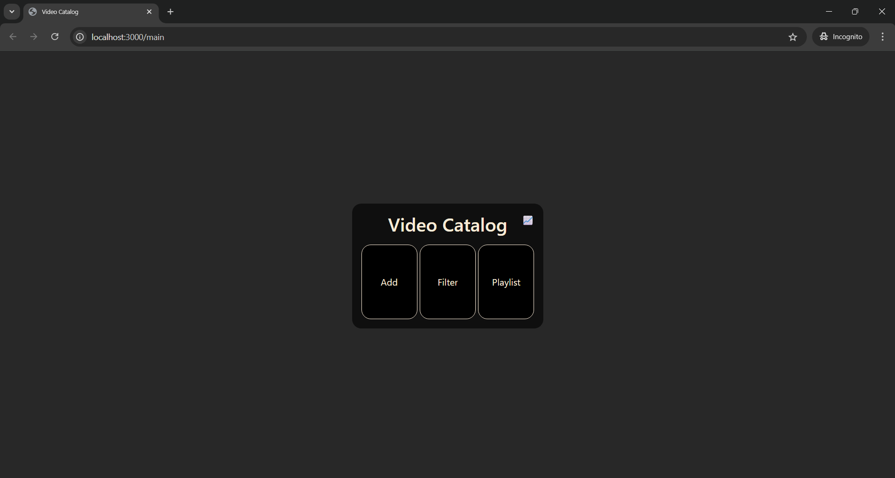
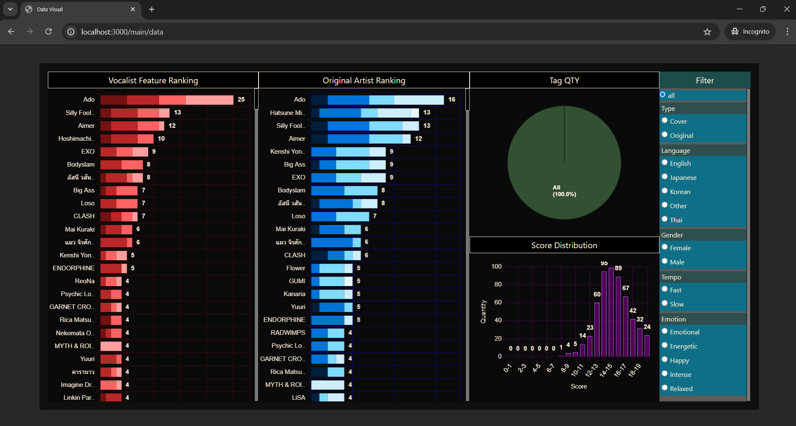
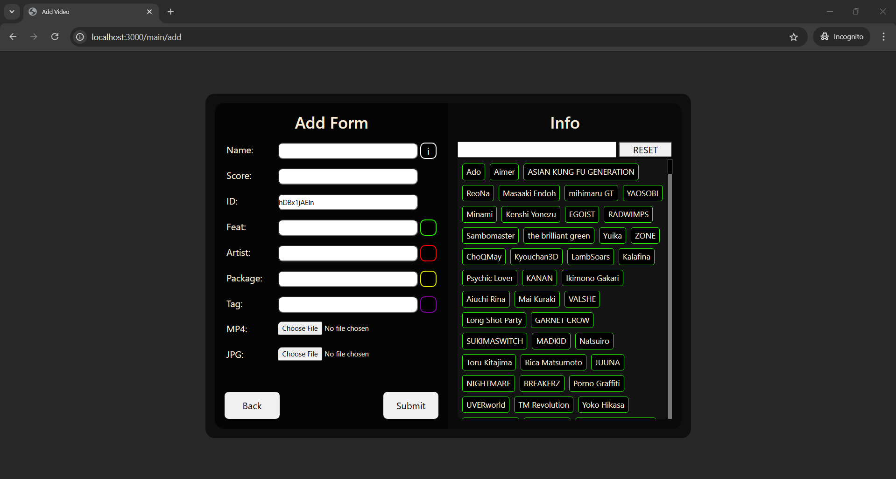
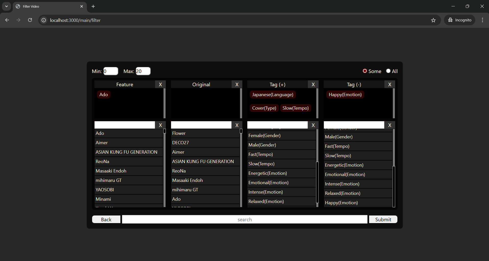
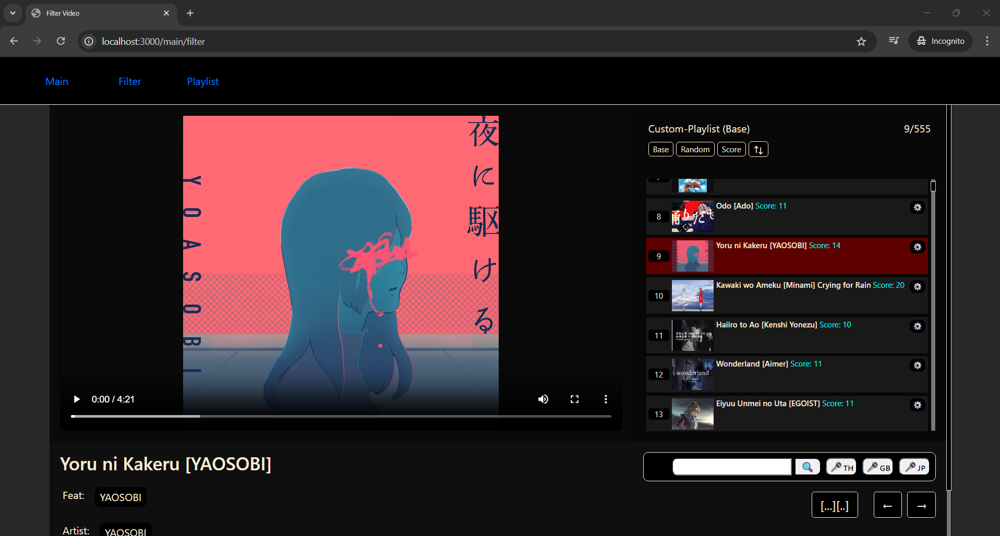
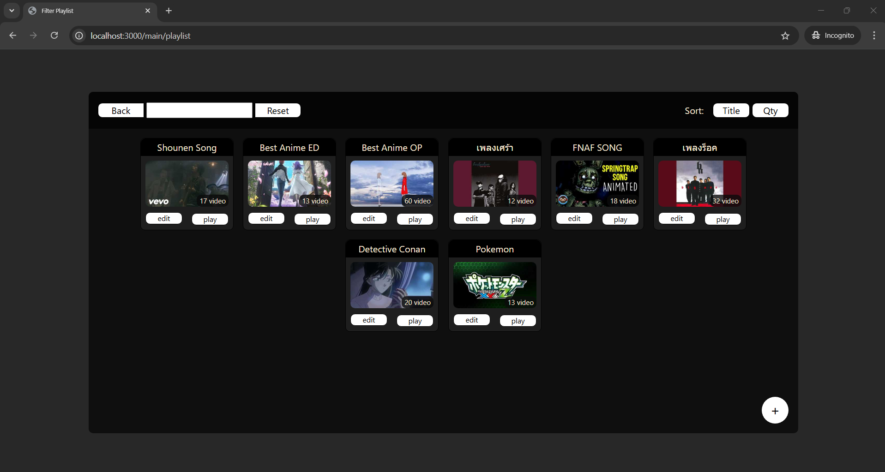
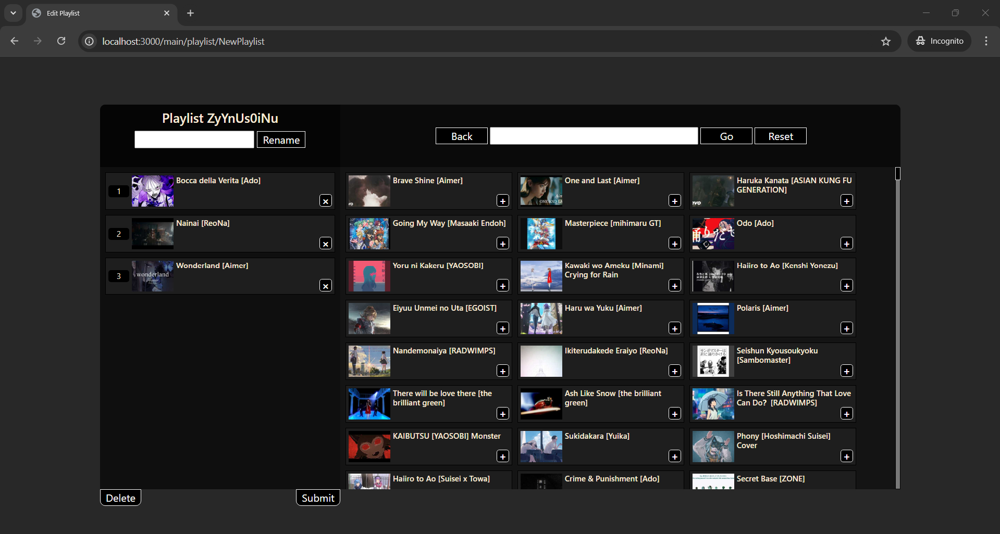

# Video Management App

A full-stack local web app to organize and manage music videos. Built with Node.js, Express, and EJS, this project supports playlist creation, video filtering, smart playback, and data visualization—designed for personal use and as a learning project to apply full-stack skills.

## Key Features

- Full CRUD (Create, Read, Update, Delete) for video entries
- Custom playlist creation with drag-and-drop and reordering
- Advanced filtering: by score, tags, artist, feature, keywords
- Playlist playback with options: shuffle, score-order, reverse
- Edit metadata for any video
- Data visualization using Chart.js
- JSON-based data storage (no database needed)

---

## Screenshots

**Main Page**  


**Filter Page**  


**Playlist Overview**  


**Data Visualization**  


**Add/Edit Video Form**  


**Drag-and-Drop Playlist Editor**  


**Smart Playback UI**  


---

## 🚀 Setup Instructions

```bash
npm install
node app.js
